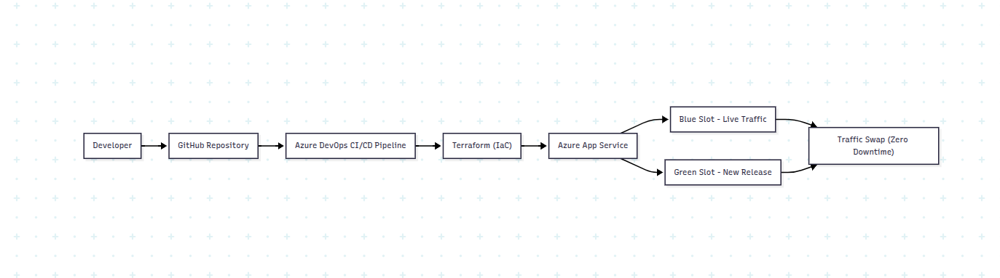

📌 Overview

This project demonstrates a production-ready Blue-Green deployment strategy on Microsoft Azure using Terraform (Infrastructure as Code) and Azure DevOps CI/CD pipelines.

The goal is to achieve zero-downtime deployments, safe rollbacks, and automated infrastructure provisioning, following modern DevOps best practices.

An AI-assisted validation concept is included to showcase how intelligent checks can enhance deployment reliability.

🧠 Key Concepts Demonstrated

Blue-Green Deployment Strategy

Infrastructure as Code (Terraform)

CI/CD Automation with Azure DevOps

Zero-Downtime Releases

Automated Traffic Switching

AI-Assisted Deployment Validation (Conceptual)

Cloud Cost & Reliability Awareness

🏗️ Architecture
Developer Commit
      ↓
Azure DevOps Pipeline
      ↓
Build & Package App
      ↓
Deploy to GREEN Slot
      ↓
Health Validation (AI-assisted logic)
      ↓
Swap Slots (GREEN → Production)
      ↓
BLUE Slot retained for rollback

🔵🟢 Blue-Green Deployment Explained

BLUE → Current live production environment

GREEN → New version deployed and tested in isolation

Traffic is switched only after validation succeeds

Instant rollback by swapping slots again if issues occur

✅ This ensures no downtime and minimal risk during releases.

📂 Project Structure
azure-bluegreen-ai-devops/
│
├── app/
│   ├── app.py                 # Python Flask application
│   └── requirements.txt
│
├── terraform/
│   ├── main.tf                # Azure resources
│   ├── variables.tf
│   └── outputs.tf
│
├── azure-pipelines.yml        # CI/CD pipeline definition
├── app.zip                    # Deployment artifact
└── README.md

⚙️ Technologies Used
Category	Tools
Cloud	Microsoft Azure
IaC	Terraform
CI/CD	Azure DevOps Pipelines
App	Python (Flask)
Deployment	Azure App Service + Deployment Slots
Strategy	Blue-Green Deployment
Validation	AI-assisted logic (conceptual)
🔁 CI/CD Pipeline Workflow

Code Commit triggers Azure DevOps pipeline

Application is built and packaged

Terraform provisions or updates Azure infrastructure

App is deployed to GREEN deployment slot

Health checks & validation

Traffic is swapped from BLUE to GREEN

BLUE remains available for rollback

🤖 AI-Assisted Deployment Validation (Concept)

This project introduces a lightweight AI-assisted approach for deployment safety:

Automated health-check analysis

Deployment readiness evaluation

Future-ready foundation for:

Anomaly detection

Failure prediction

Intelligent rollback decisions

💡 The AI component is intentionally kept minimal to focus on DevOps fundamentals while showcasing forward-thinking design.

🔐 Security & Reliability Considerations

No hard-coded secrets

Infrastructure versioned via Terraform

Rollback-friendly deployment design

Production isolation using slots

Minimal downtime risk

📈 Why This Project Matters (Interview Perspective)

This project demonstrates:

✔ Real-world Azure DevOps experience
✔ Practical blue-green deployment implementation
✔ Strong understanding of CI/CD pipelines
✔ Hands-on Terraform Infrastructure as Code
✔ Cloud-native reliability engineering mindset
✔ Ability to combine DevOps + AI concepts

▶️ How to Run (High Level)

Configure Azure credentials

Initialize Terraform

terraform init
terraform apply

Push code to trigger Azure DevOps pipeline

Observe GREEN deployment & slot swap

📌 Future Enhancements

Fully automated rollback logic

Real AI model for deployment anomaly detection

Monitoring with Azure Monitor & Application Insights

Security scanning in pipeline

Canary deployment support

👨‍💻 Author

Prince Joshi
Cloud & DevOps Engineer
🔗 GitHub: https://github.com/prince301194713

## 🏗️ Architecture Overview

